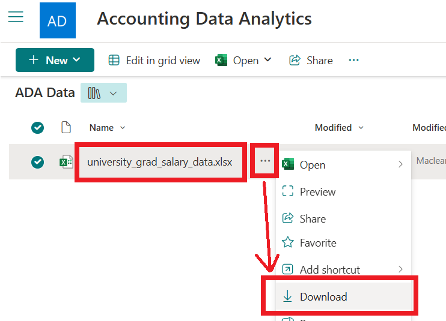
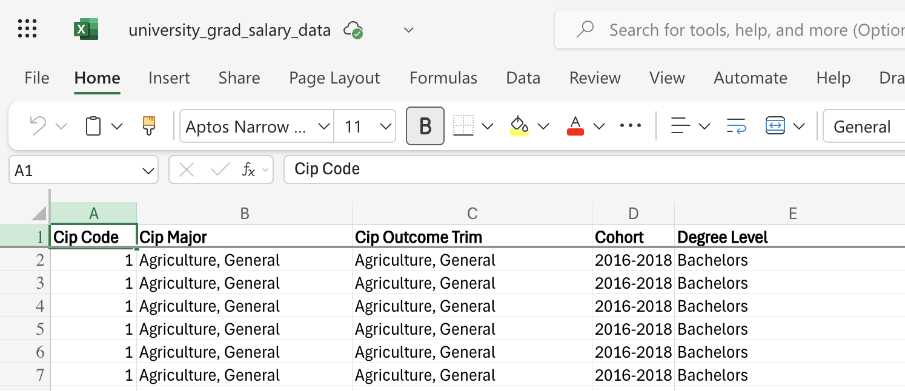
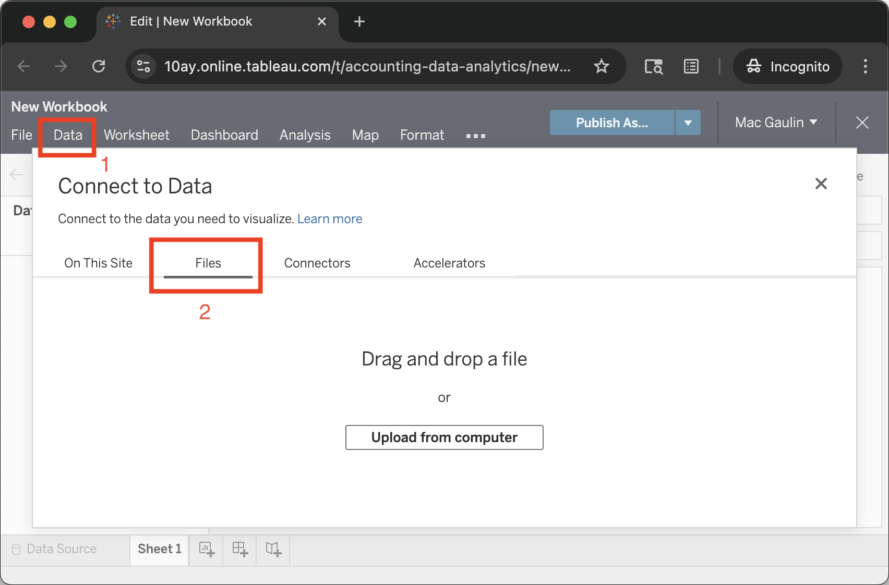
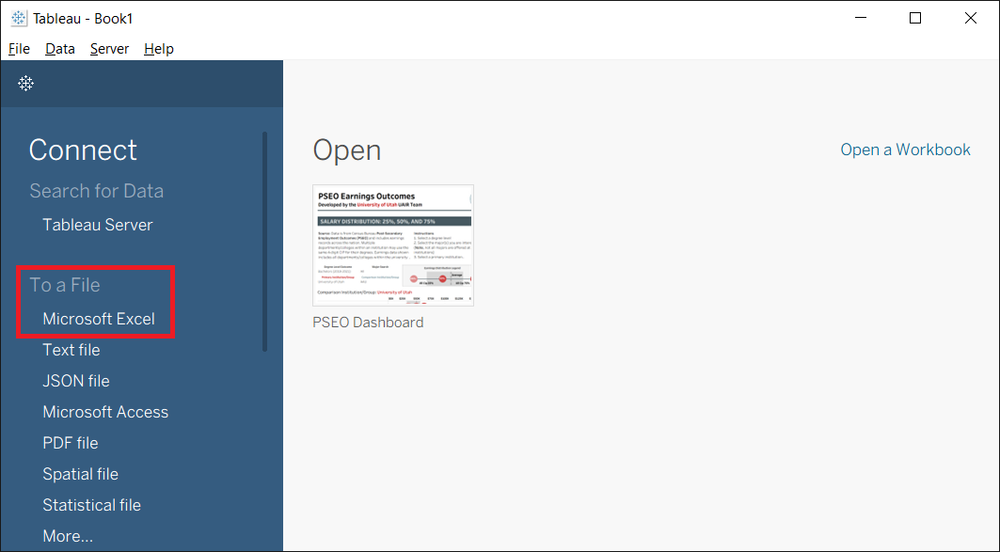
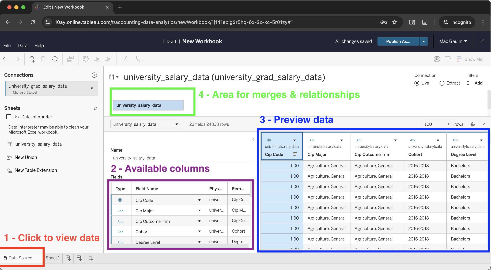
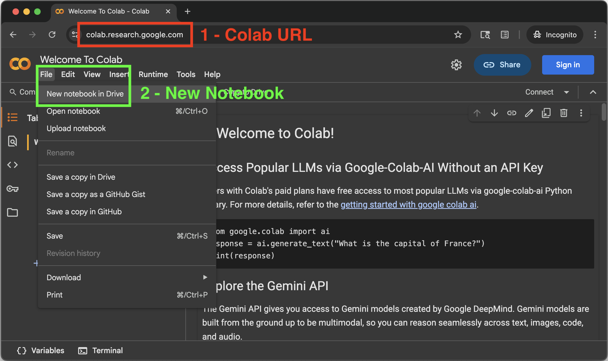
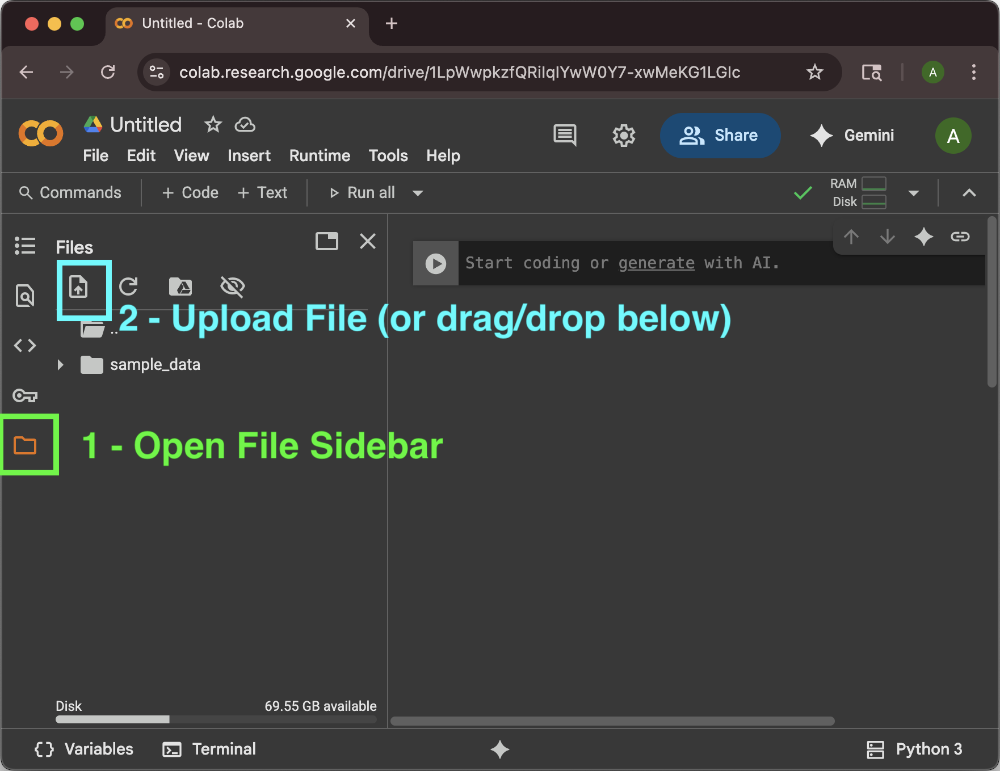
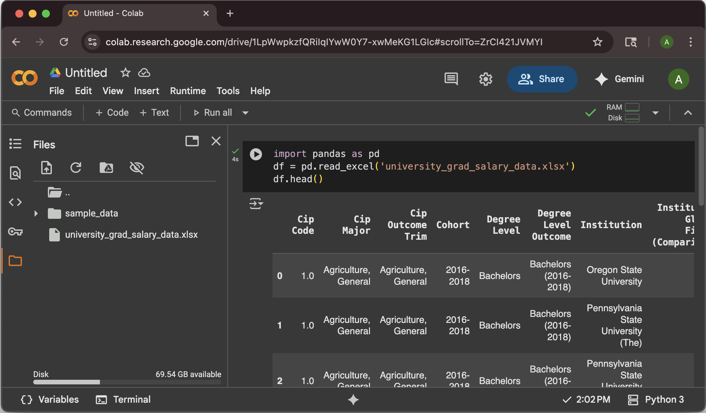

# Lab 1: Opening Software


Lab 1 will be an overview of the three "modalities" that I suggest for completing the labs: Microsoft Excel, Tableau, and Python. This initial lab is designed to ensure you can access and open a dataset in each environment. We will perform the same basic task of opening a data file on all three platforms to familiarize you with the initial steps of a data analytics workflow and to get a very preliminary feel for each tool (and see their differences).

[TOC]

### Learning Objectives

By the end of this lab, you will be able to:

* Successfully download a dataset and locate it on your computer.
* Open and view a data file in Microsoft Excel, Tableau, and a Python Jupyter Notebook.
* Understand the fundamental role each software plays in data analysis.
* Recognize potential cross-platform differences and how to manage them.

### A Note on Platforms (Windows, macOS, Linux)

All three of the "modalities" in this course are available in desktop form on Windows and macOS, while (I believe) only Python is available on Linux. All three tools are available online, however, which is primarily what the instructions below are intended to show. My intent is that these labs can be completed on any machine (maybe even your phone?). If you find this isn't the case, or if you find an issue related to operating systems, please let me know!


## Data

The dataset we will be opening in all three pieces of software is from the [University of Utah Analytics](https://data.utah.edu/) team, specifically the Post-Secondary Employment Outcomes (PSEO), which is from the Census Bureau and tracks salaries for institutions by institution (i.e. University of Utah). The Analytics group has a nice Tableau dashboard using this data [here](https://data.utah.edu/data-dashboard/salary-outcomes/).

The data is an Excel spreadsheet ([link](https://uofutah.sharepoint.com/:x:/s/AccountingDataAnalytics/Efsc48FWDS1LoRMKZPoNBVwB8iNdL2uE3M-gnFw_nPKbHQ?e=cd0PAh)) located on the class [Sharepoint](https://uofutah.sharepoint.com/sites/AccountingDataAnalytics/ADA%20Data/Forms/AllItems.aspx).




## Step 1 \- Excel

The first software will be Excel. Excel, an Accountant's workhorse, is a ubiquitous spreadsheet tool that is excellent for initial data exploration, cleaning, and analysis.

1. **Download the Data:** Open the Sharepoint data site ([link](https://uofutah.sharepoint.com/sites/AccountingDataAnalytics/ADA%20Data/Forms/AllItems.aspx)). Find `university_grad_salary_data.xlsx` in the list. You now have two options.
      1. **Open the file online:** Simply click on the filename `university_grad_salary_data.xlsx`. This will open the spreadsheet directly in your web browser using Excel Online. This is a great way to quickly preview the data without downloading anything. Note that Excel Online has most, but not all, of the features of the desktop application.
      2. **Download the file locally**: Click the three horizontal dots to the right of the filename, and select "Download." Your browser will download the file. Locate the downloaded file (e.g. in your "Downloads" folder) and double-click to open it in Microsoft Excel (assuming you have Excel installed).
2. **Browse the Data:** Regardless of online or local, once the dataset is open in Excel, you will see several columns of data. Take a moment to look at the headers and the first few rows to get a general sense of the information. The data is "structured," meaning each row is an observation and each column is a variable.
   
3. **Save the File:** Save a copy of the file to your personal project folder for this course.


## Step 2 \- Tableau

The second software will be Tableau. Tableau is a leading data visualization tool that allows for the creation of interactive dashboards and worksheets.

1. **Open Tableau:** Launch Tableau Desktop, Tableau Cloud, or Tableau Public depending on which you are using.

2. **Connect to Data:** Open the Connection pane, and connect to a File (type Microsoft Excel).

      1. *Tableau Cloud*: On the New Workbook page, under the "Data" menu, select "New Data Source." In the popup titled "Connect to Data", select the "Files" tab, then drag and drop the downloaded Excel file from Step 1.
         
      2. *Tableau Desktop*: On the start page, under the "Connect" pane on the left, select "Microsoft Excel". A file dialog will open. Navigate to where you saved the data file from Step 1, select it, and click "Open".
         

3. **Verify the Data Source:** Tableau will now show you the "Data Source" tab. You should see the data loaded in a table format, similar to Excel. You can verify the column names and data types here.
   

4. **(Optional) Go to Worksheet:** In the bottom-left corner (next to "Data Source"), click on "Sheet 1" to move from the data source view to a worksheet, where you can begin building visualizations.


## Step 3 \- Python

The third software will be Python. We will use **Google Colaboratory (Colab)**, a free, cloud-based Jupyter Notebook environment that requires no local installation. Python is a versatile programming language with powerful libraries for data analysis, such as pandas.

1. **Go to Google Colab:** Open your web browser and navigate to [colab.research.google.com](https://colab.research.google.com/). You may need to be logged into a Google account.

      1. **Alternative:** If you prefer to work locally, you can install python on your own machine (I suggest this\!). You will just need to ensure you have the notebook and pandas libraries installed to follow along. If this is a route you are interested in, I further suggest looking into `mamba` (or `uv`/`pixi` if you're feeling fancy) and using environments.
          

2. **Create a New Notebook:** On the Colab page, go to the File menu and select New notebook. *Note:* if you're logged into a google account, you may see a pop-up window that says "Open Notebook", and you can just click "New Notebook" at the bottom left instead of using the menu.

3. **Upload Data to Session:** Before we can load the data, we must upload it to our Colab session.

     1. On the left-hand sidebar, click the **Files** icon (it looks like a folder).
     2. Click the **Upload to session storage** icon (a page with an upward-pointing arrow).
     3. In the file browser that opens, find and select the `university_grad_salary_data.xlsx` file you downloaded in Step 1\.
       
       **Important Note:** Files uploaded this way are temporary and will be deleted when the Colab session ends. You will need to re-upload your data file each time you open this notebook. To not lose data, you can store files in your Google Drive (the university has given you a Google account at `uid@gcloud.utah.edu` if you don't have a personal one).

4. **Import the pandas Library:** In the first code cell, we need to import the pandas library. Type the following code and press Shift \+ Enter (or click the play button) to run the cell: `import pandas as pd`. We can now access pandas library by using `pd`.

5. **Load the Data:** We will use the pandas `read_excel` function to read the Excel file. Since we uploaded the file directly to the folder for our session, we only need to use its name (no needing to figure out a file path). So we just have to type and run:
   ```
   import pandas as pd
   # The file name should be what you uploaded
   df = pd.read_excel("university_grad_salary_data.xlsx")
   ```
6. **Display the Data:** To confirm the data has loaded correctly, you can display the first few rows of the data. In a new cell, type the following and run it: `df.head()`. This will display the column headers and the first five rows of your dataset directly in the notebook.
   

7. **Optional**: A bit about Pandas: in Pandas, data is stored in a `pd.DataFrame`, which is just an excel table, and each column is a `pd.Series`. If you want multiple sheets, just make multiple dataframes (e.g. `df1`, `df2`, etc.).


## Submission

To complete this lab, you will provide evidence that you have successfully opened the data file in all three modalities.

1. **Take Screenshots:**
    * Capture a screenshot of the data open in **Excel** or **Excel Online**.
    * Capture a screenshot of the data loaded in the **Tableau** "Data Source" tab.
    * Capture a screenshot of your **Google Colab** notebook showing the output of the `df.head()` command.
    * *Windows Note:* To take a [screenshot on Windows](https://support.microsoft.com/en-us/windows/use-snipping-tool-to-capture-screenshots-00246869-1843-655f-f220-97299b865f6b), press `Win + Shift + s` and then click-and-drag a rectangle to capture that portion of your screen (to grab the full screen, hit `PrtSc` on the keyboard, or `Alt + PrtSc` to capture just the current window).
    * *macOS Note:* To take a [screenshot on macOS](https://support.apple.com/en-il/102646), `Shift + Command + 5` will open the screenshot app, which is nice, or `Shift + Command + 4` will let you click-and-drag a rectangle to capture that portion of your screen (which I believe saves the screenshot to a file, but I don't know where? If you want to just copy the screen to your clipboard for pasting into word/Google Docs, add Control, so `Control + Shift + Command + 4`).

2. **Create a Document:**
    * Open a new document in a word processor like Microsoft Word or Google Docs.
    * Paste all three screenshots into this single document.

3. **Save as PDF:**
    * Save or export the document as a PDF file. Name it `[your uid]_Lab1.pdf`.

4. **Submit to Canvas:**
    * Navigate to the "Lab 1" assignment on our course Canvas page and upload your PDF file.
