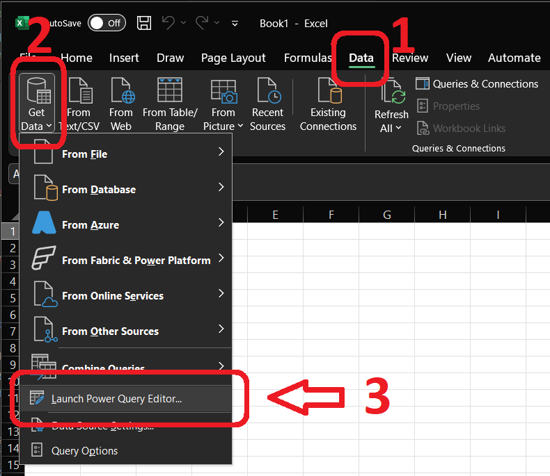

# Lab 2: Connecting to and Cleaning Data

Lab 2 builds on our first lab by moving from simply opening a clean, well-structured file to tackling a more realistic challenge: importing and cleaning a poorly formatted journal entry data. We will work with a dataset of journal entries that contains extra header lines and page breaks that must be removed before analysis can begin. This lab will reinforce the initial data connection steps from Lab 1 and introduce basic data cleaning techniques.

[TOC]

## Assignment Notes

### Learning Objectives

By the end of this lab, you will be able to:

  * Import data from a text file.
  * Identify and remove unnecessary rows (like headers and page breaks) from a dataset.
  * Perform basic data transformations to prepare data for analysis.
  * Perform initial exploration of data content.

### Submission Expectations

  * Submit a PDF document with screenshots demonstrating the successful cleaning and initial analysis of the data, as described below.

### Rubric and Grading

1. **Submitted**: *Submitted the assignment*
    * **3 - Successful:** Submitted a completed solution. (80 pts)
    * **2 - Successful - late:** Submitted a completed solution after the deadline. (70 pts)
    * **1 - Incomplete:** Submitted a partial result. (50 pts)
    * **0 - No Evidence:** No submission. (0 pts)
2. **Mastery**: *Submitted the assignment in more than one modality. Expectation is just one, this is for more points and more experience.*
    * **2 - Exceeds:** Submitted in three or more modalities, amazing job! (10 pts)
    * **1 - Mastery:** Submitted in two modalities, fantastic job! (5 pts)
    * **0 - Expected:** Submitted one modality, great job! (0 pts)
3. **Subjective** quality: *Subjective estimate of the quality of the output. For this lab, that will be based on the appearance and clarity of the output and tables demonstrated in your screenshots.*
    * **3 - High Quality:** Beautiful, graceful, clever, or otherwise high quality product. (15 pts)
    * **2 - Good Quality:** Aesthetic, elegant, logical, or otherwise good quality. (10 pts)
    * **1 - Low Quality:** Messy, quick, illogical, confusing, or otherwise low quality product. (5 pts)
    * **0 - None:** No submission. (0 pts)

*AI useage note: I developed this rubric in Canvas, then I took a screenshot of it, pasted it into Gemini with the prompt "Please transcribe this rubric to markdown format", and got the above text. I tell you this as a reminder of little uses of LLMs that add up to save a whole lot of time.*


## Data

The dataset for this lab is `JEA Detail.txt`, a **tab-separated value (TSV)** file containing journal entry line items. This is a type of **delimited text file**, which is a common ways to store and exchange tabular data. Instead of a special format like an Excel `.xlsx` file, these are simple text files that can be opened by almost any application.

??? "More information on delimited files"
    In delimited files, columns are separated by a specific character, the **delimiter**. Common delimiters include:

    * **Comma (`,`)**: These are called Comma-Separated Values, or CSV files. This is the most common type of delimited file.
    * **Tab (`\t`)**: These are Tab-Separated Values, or TSV files, like the one we are using.
    * **Pipe (`|`)**: These are Pipe-Separated Values.

    Another related format is a **fixed-width file**, where each column is a specific number of characters wide, and data is padded with spaces to fit.

    While delimited files are very portable, that portability can lead to issues. They are often generated by legacy systems or as simple data dumps, resulting in "dirty" data that requires cleaning. Common problems include:
    * **Non-tabular features**: The file might contain extra information at the beginning or end, such as a report title, a description, a timestamp, or, in our case, repeating page headers and footers that are not part of the data itself.
    * **Uneven rows**: Some rows might have fewer columns than others, often due to missing trailing delimiters for empty values at the end of a line.
    * **Quoting and encoding issues**: Text data that contains the delimiter (e.g., a comma in a description field) must be handled carefully, usually by quoting the text. The file's character encoding (e.g., UTF-8 vs. ASCII) can also cause problems if not interpreted correctly.
    * **Inconsistent data types**: A column might contain a mix of numbers and text, making it difficult for software to automatically detect the correct data type.


Our file, `JEA Detail.txt`, represents a common scenario where a system output is not perfectly structured for direct use in analytics tools. It includes repeating header sections and other non-data lines that we will need to remove before any further understanding or analysis can be conducted.

For reference, here is the first few lines of the file:

```txt
Company XYZ                                                                                                PAGE 0001
REPORT DATE: 02/07/22  12:32                                                                                        
                                              GENERAL LEDGER DETAIL                                                 
                                              AS OF 12/31/21                                                        
====================================================================================================================
                   Account   Post               User                            Transaction                         
Account            Category  Date       Period  ID         Manual  Description  Number       Location  Amount       
9504 Rent Expense  SG&A      9/11/2024  9       Laura4     Yes     Rent         1000         LA        " 50,000.00 "
9504 Rent Expense  SG&A      8/11/2024  8       Automated  No      Rent         1001         LA        " 50,000.00 "
```


## How-to Steps

The following sections outline how to perform the lab in each modality.

### Excel Steps

This lab can be done using base Excel, or by testing out Excel's Power Query (Get & Transform Data), which is a tool for these kinds of cleaning tasks, among other great uses.

1. **Open Dataset:**
   1. **Using Base Excel:**
      * Open Excel.
      * Drag the `JEA Detail.txt` file into the Excel window. Excel will open it easily, doing all the hard bits that the Python folk have to figure out manually.
   2. **Using Power Query:**
      * Open Excel.
      * Go to the `Data` tab on the ribbon (you may have to open a blank worksheet if you don't see the ribbon).
      * In the "Get & Transform Data" group (far left), click `Launch Power Query Editor...`.
      
      * In the "Home" tab, select `New Source` > `File` > `Text/CSV`.
      
      * Select the `JEA Detail.txt` file and click `OK` in the subsequent window (which will be showing you the first 100 rows of the file).
      * *Optional: Clean the data*
          * *Use the "Remove Rows" feature to remove the top rows until you get to the actual headers.*
          * *Use the "Use First Row as Headers" button to promote the correct header row.*
          * *Filter out any remaining junk rows (e.g., rows that are completely null or contain page break markers). You can filter a column to exclude `null` values or specific text.*
      * Once the data is loaded (or cleaned, if you so choose), click `Close & Load` in the top-left corner of the Power Query Editor. The cleaned data will be loaded into a new sheet in your workbook.
2. **Clean the Data**
    * You should see an improperly formatted set of data, like this:
    
    * You will notice extra header rows, and other issues throughout the file.
    * You now need to clean the data, which can be done manually, in Excel or with the Power Query tools.
    * Excel approach:
        1. *Delete Top Rows:* The first 8 rows of the file are report headers and can be deleted. Highlight rows 1-8, right-click, and select "Delete".
        2. *Promote Headers:* Row 1 now has the first half of the headers, and row 2 the second. Manually combine these into a single header row (row 1). For example, the first column header should be "Account", the second "Account Category", and so on. Delete the now-redundant second row of headers.
        3. *Create a Table:* Select any cel l of data and press `Ctrl + T` to format the data as a table (Excel will guess what the extent of your table is, but if you want, you can manually select all the data you want to be in the table). Make sure the "My table has headers" box is checked. Click "OK".
        4. *Filter Bad Rows:* Click the filter dropdown on the "Account" column and uncheck "(Blanks)". This will hide any rows that are not real data, like page separators or empty lines. You can also select only the blanks, then delete those rows.
        5. *Clean User ID Column:* The "User ID" column appears to have some missing values. Select one of those missing cells, and see if you can identify what is wrong by asking an LLM. Consider the `TRIM` and `CLEAN` functions in Excel as a solution (`TRIM` will not work, while `CLEAN` will. Why?)
3. **Initial Analysis:**
    * List the unique "User ID" names.
        * There are multiple ways of doing this. Here are three that I can think of, and I suggest you try out all three and consider pros and cons:
            * *Manual:* Click the dropdown on the "User Name" column and manually type the values displayed there in a new sheet.
            * *Automated:* Use the `Remove Duplicates` feature in the `Data` tab.
            * *More Automated:* Use a pivot table to summarize the unique values. (Note: the homework will follow up on pivot table usage, so it might be good to get some practice now!)

### Tableau Steps

Tableau's Data Source tab offers tools to clean data upon import.

1. **Connect to Data:**
    * Open Tableau.
    * On the "Connect" pane, click on `Text File`.
    * Navigate to and select `JEA Detail.txt`.
2. **Clean the Data with Data Interpreter:**
    * Tableau will open the Data Source tab. It will misinterpret the file structure initially.
    * In the left pane, under "Sheets", turn on the `Data Interpreter` checkbox.
    * Data Interpreter will analyze the file and identify the actual data table, often correctly removing headers and footers.
        * I had to rename a few columns, e.g. `F3` &rarr; `Post Date`. See table snippet above for column names.
    * Review the results to ensure the data looks correct.
    * You may need to add filters to remove any remaining unwanted rows.
3. **Go to Worksheet and Explore:**
    * Click on "Sheet 1" to begin visualizing.
4. **Initial Analysis:**
    * List the unique "User ID" names. This can be done by simply dragging the "User ID" field to the Rows shelf.


### Python Steps

Note to Python users: as with all programming, our lives are simultaneously easier and harder. Easier, because we are in control of every byte of data and can set up automation to be far more robust. Harder, because we must control of every byte of data and set up automation to be far more robust. In this Lab, that means we need to be explicit about handling each data issue in the file that tools like Excel and Tableau might manage for us. To get you started, I have prepared a notebook that you can open on Colab. Merely click the link below to open Colab, then drag the `JEA Detail.txt` file into the Colab file explorer so the code can access it.

<a href="https://colab.research.google.com/github/gaulinmp/AccountingDataAnalytics/blob/main/labs_hw/week2_connecting-to-data/Lab 2 - Opening and Cleaning Data.ipynb" target="_parent">

</a>

We will use the `pandas` library in a Jupyter Notebook to programmatically clean the data.

1. **Setup Notebook:**
    * Open my starter notebook in Google Colab (or a local Jupyter Notebook if you're adventurous).
    * If in Colab, upload the `JEA Detail.txt` file to your session storage.
2. **Load and clean the data:**
    * We will import the data, but since it's poorly formatted, we'll need to handle the import carefully. The starter notebook I've provided walks you through that, as well as debugging you might do in a real scenario.
4. **Initial Analysis:**
    * With clean data, the power of pandas comes into play. You can easily list the unique "User ID" names with `df['User ID'].unique()`. Finally, we get a break.


## Submission

To complete this lab, provide evidence that you have successfully cleaned the data and performed the initial analysis in one or more modalities.

1. **Take Screenshots:**
    * Capture a screenshot of the cleaned data table. Don't worry about the aesthetics of the table, the default format for whichever tool you used is fine (for now).
    * Capture a screenshot of the unique "User ID" names. Here's where the aesthetics might matter a bit more, as you'll want to clearly show the distinct values.
2. **Create a Document:**
    * Open a new document in a word processor like Microsoft Word or Google Docs.
    * Paste all screenshots into this single document.
3. **Save as PDF:**
    * Save or export the document as a PDF file. Name it `[your uid]_Lab2.pdf`.
4. **Submit to Canvas:**
    * Navigate to the "Lab 2" assignment on our course Canvas page and upload your PDF file.
