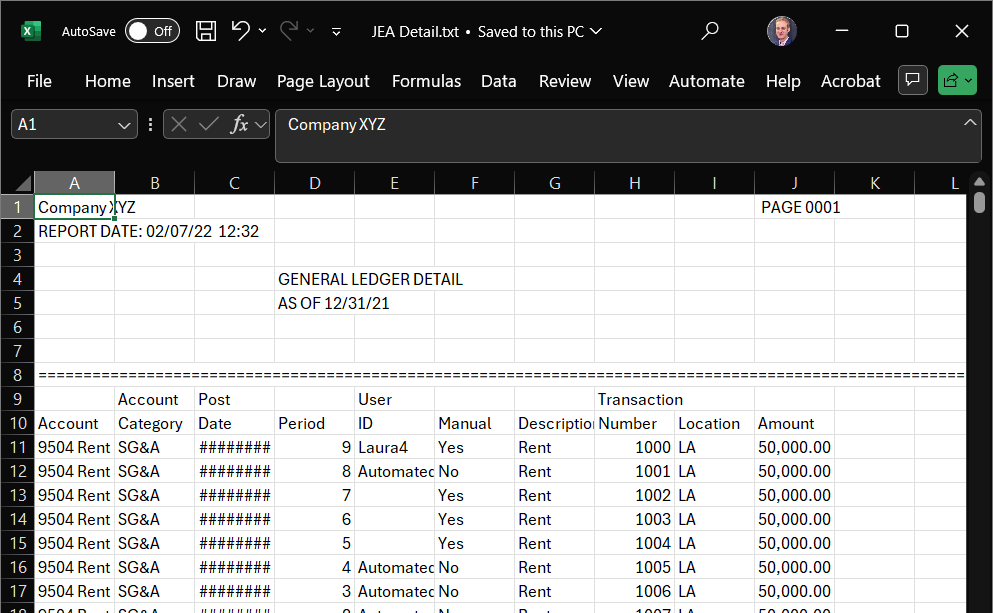

# Lab 2: Connecting to and Cleaning Data

Lab 2 builds on our first lab by moving from simply opening a clean, well-structured file to tackling a more realistic challenge: importing and cleaning a poorly formatted journal entry data. We will work with a dataset of journal entries that contains extra header lines and page breaks that must be removed before analysis can begin. This lab will reinforce the initial data connection steps from Lab 1 and introduce basic data cleaning techniques.

[TOC]

## 1. Assignment


**Submission:** Two screenshots:

  * One of the cleaned dataset (at least including all columns and the first 10 rows)
  * One of the unique User IDs associated with the journal entries


### 1.1. Learning Objectives

By the end of this lab, you will be able to:

  * Import data from a text file.
  * Identify and remove unnecessary rows (like headers and page breaks) from a dataset.
  * Perform basic data transformations to prepare data for analysis.
  * Perform initial exploration of data content.


### 1.2. Rubric and Grading

The intent of this submission is to produce a cleanly formatted dataset that could be handed off to a client or supervisor. It should look professional and require no further cleaning by the recipient.

* *5 points*: No mistakes. The dataset is cleanly formatted (no extra whitespace, numbers are properly formatted, etc.), and column headers are correct.
* *4 points*: Some mistakes (e.g., leftover whitespace like newlines or spaces at the beginning of the cell, unformatted numbers, correctable header issues).
* *3 points*: Significant errors.
* *2 points*: Incomplete submission.


## 2. Data

The dataset for this lab is `JEA Detail Raw.txt` ([link](https://utah.instructure.com/courses/1243774/files/192656669/download?download_frd=1)), a **tab-separated value** file containing journal entry line items. This is a type of **delimited text file**, which is a common ways to store and exchange tabular data. Instead of a special format like an Excel `.xlsx` file, these are simple text files that can be opened by almost any application.

??? "More information on delimited files"
    In delimited files, columns are separated by a specific character, the **delimiter**. Common delimiters include:

    * **Comma (`,`)**: These are called Comma-Separated Values, or CSV files. This is the most common type of delimited file.
    * **Tab (`\t`)**: These are Tab-Separated Values, or TSV files, like the one we are using.
    * **Pipe (`|`)**: These are Pipe-Separated Values.

    Another related format is a **fixed-width file**, where each column is a specific number of characters wide, and data is padded with spaces to fit.

    While delimited files are very portable, that portability can lead to issues. They are often generated by legacy systems or as simple data dumps, resulting in "dirty" data that requires cleaning. Common problems include:
    * **Non-tabular features**: The file might contain extra information at the beginning or end, such as a report title, a description, a timestamp, or, in our case, repeating page headers and footers that are not part of the data itself.
    * **Uneven rows**: Some rows might have fewer columns than others, often due to missing trailing delimiters for empty values at the end of a line.
    * **Quoting and encoding issues**: Text data that contains the delimiter (e.g., a comma in a description field) must be handled carefully, usually by quoting the text. The file's character encoding (e.g., UTF-8 vs. ASCII) can also cause problems if not interpreted correctly.
    * **Inconsistent data types**: A column might contain a mix of numbers and text, making it difficult for software to automatically detect the correct data type.


Our file, `JEA Detail.txt`, represents a common scenario where a system output is not perfectly structured for direct use in analytics tools. It includes repeating header sections and other non-data lines that we will need to remove before any further understanding or analysis can be conducted.

For reference, here is the first few lines of the file:

```txt
Company XYZ                                                                                                PAGE 0001
REPORT DATE: 02/07/22  12:32                                                                                        
                                              GENERAL LEDGER DETAIL                                                 
                                              AS OF 12/31/21                                                        
====================================================================================================================
                   Account   Post               User                            Transaction                         
Account            Category  Date       Period  ID         Manual  Description  Number       Location  Amount       
9504 Rent Expense  SG&A      9/11/2024  9       Laura4     Yes     Rent         1000         LA        " 50,000.00 "
9504 Rent Expense  SG&A      8/11/2024  8       Automated  No      Rent         1001         LA        " 50,000.00 "
```


## 3. How-to Steps

The following sections outline how to perform the lab in each modality.

### 3.1. Excel Steps

This lab can be done using base Excel, or by testing out Excel's Power Query (Get & Transform Data), which is a tool for these kinds of cleaning tasks, among other great uses.

1. **Open Dataset:**
    * **Option A:** Using Base Excel:
        * Open Excel.
        * Drag the `JEA Detail.txt` file into the Excel window. Excel will open it easily, doing all the hard bits that the Python folk have to figure out manually.
    * **Option B:** Using Power Query
        * Open Excel.
        * Go to the "Data" tab on the ribbon (you may have to open a blank worksheet if you don't see the ribbon).
        * In the "Get & Transform Data" group (far left), click "Launch Power Query Editor...".
        
        * In the "Home" tab, select "New Source" > "File" > "Text/CSV".
        
        * Select the `JEA Detail.txt` file and click "OK" in the subsequent window (which will be showing you the first 100 rows of the file).
        * *Optional: Clean the data*
            * *Use the "Remove Rows" feature to remove the top rows until you get to the actual headers.*
            * *Use the "Use First Row as Headers" button to promote the correct header row.*
            * *Filter out any remaining junk rows (e.g., rows that are completely null or contain page break markers). You can filter a column to exclude `null` values or specific text.*
        * Once the data is loaded (or cleaned, if you so choose), click "Close & Load" in the top-left corner of the Power Query Editor. The cleaned data will be loaded into a new sheet in your workbook.
2. **Clean the Data:**
    1. You should see an improperly formatted set of data, like this:
    
    2. You will notice extra header rows, and other issues throughout the file.
    3. You now need to clean the data, which can be done manually, in Excel or with the Power Query tools (see above).
    4. Excel approach:
        1. *Delete Top Rows:* The first 8 rows of the file are report headers and can be deleted. Highlight rows 1-8, right-click, and select "Delete".
        2. *Promote Headers:* Row 1 now has the first half of the headers, and row 2 the second. Manually combine these into a single header row (row 1). For example, the first column header should be "Account", the second "Account Category", and so on. Delete the now-redundant second row of headers.
        3. *Create a Table:* Select any cell of data and press `Ctrl + T`/`Cmd + T` to format the data as a table (Excel will guess what the extent of your table is, but if you want, you can manually select all the data you want to be in the table). Make sure the "My table has headers" box is checked. Click "OK".
        4. *Filter Bad Rows:* Some rows of the dataset are left-over formatting issues, and should be removed. You can either filter them out (e.g. uncheck "(Blanks)") or select only the blanks and delete the rows.
        5. *Clean User ID Column:* The "User ID" column appears to have some missing values. Select one of those missing cells, and see if you can identify what is wrong by asking an LLM. Consider the `TRIM` and `CLEAN` functions in Excel as a solution (`TRIM` will not work, while `CLEAN` will. Why?)
    5. Screenshot the first few rows of the cleaned data for submission.
3. **Initial Analysis:**
    * List the unique "User ID" names.
        * There are multiple ways of doing this. Here are three that I can think of, and I suggest you try out all three and consider pros and cons:
            * *Manual:* Click the dropdown on the "User Name" column and manually type the values displayed there in a new sheet.
            * *Automated:* Use the `Remove Duplicates` feature in the `Data` tab.
            * *More Automated:* Use a pivot table to summarize the unique values. (See [section at the end of this lab](#5-optional-pivot-tables-overview) for a mini-tutorial.)
    * Screenshot the unique "User ID" names for submission. It's up to you how you want to present this aesthetically.


### 3.2. Python Steps

Note to Python users: as with all programming, our lives are simultaneously easier and harder. Easier, because we are in control of every byte of data and can set up automation to be far more robust. Harder, because we must control of every byte of data and must set up automation to be far more robust. In this Lab, that means we need to be explicit about handling each data issue in the file that tools like Excel might manage for us. To get you started, I have prepared a notebook that you can open on Colab. Merely click the link below to open Colab, then either drag the `JEA Detail Raw.txt` file into the Colab file explorer so the code can access it, or add it to your Google Drive, mount said drive, copy the path, and paste it in to your code (as we did in Lab 1).

<a href="https://colab.research.google.com/github/gaulinmp/AccountingDataAnalytics/blob/main/labs_hw/week2_connecting-to-data/Lab 2 - Opening and Cleaning Data.ipynb" target="_parent">

</a>

We will use the `pandas` library in a Jupyter Notebook to programmatically clean the data.

1. **Setup Notebook:**
    * Open my starter notebook in Google Colab (or a local Jupyter Notebook if you're adventurous).
    * If in Colab, upload the `JEA Detail Raw.txt` file to your session storage.
2. **Load and clean the data:**
    * We will import the data, but since it's poorly formatted, we'll need to handle the import carefully. The starter notebook I've provided walks you through that, as well as debugging you might do in a real scenario.
3. **Initial Analysis:**
    * With clean data, the power of pandas comes into play. You can easily list the unique "User ID" names with `df['User ID'].unique()`. Finally, we get a break.
    * You could also use a pivot table (and this might be helpful for Homework 2 :)
    ```python
    df.pivot_table(
        index='Row Variable',
        columns='Column Variable',
        values='Value to be aggregated',  # Column to calculate
        aggfunc='how to aggregate',       # 'sum', 'count', 'mean', 'median', 'std', etc.
        margins=True,                     # Add a total column
        margins_name="Total",             # Set the total column name
    )
    ```


## 4. Submission

To complete this lab, provide screenshots that you have successfully cleaned the data and performed the initial analysis in whatever modality you wish:

* Capture a screenshot of the cleaned data table.
* Capture a screenshot of the unique `User ID` names.

*Note*: Consider the aesthetics of your screenshots. Clear, well-organized tables/results will help convey your findings more effectively.


## 5. Optional Pivot Tables Overview

A crucial skill in data analytics is the ability to summarize and cross-tabulate data using pivot tables. 
Pivot tables allow you to reorganize and aggregate data to reveal patterns that might not be obvious in the raw data format.
You do not have to use Pivot Tables for this lab, but we are going to be exploring their functionality, and they would make Homework 2 easier, so I encourage you to try them out if you aren't familiar.

### 5.1. Excel Pivot Tables

Excel provides powerful pivot table functionality through its "Data" tab:

1. **Creating a Pivot Table:** [Tutorial](https://support.microsoft.com/en-us/office/create-a-pivottable-to-analyze-worksheet-data-a9a84538-bfe9-40a9-a8e9-f99134456576)
    * Select your cleaned data table
    * Go to "Insert" > "Pivot Table"
    * Choose to place the pivot table in a new worksheet
    * Drag fields from the Field List to the appropriate areas:
        * **Rows**: Categories you want to group by (e.g., `User ID`)
        * **Columns**: Categories you want to spread across columns (e.g., `Period`)
        * **Values**: Numeric fields you want to aggregate (e.g., `Sum of Amount`)

2. **Excel Advantages:**
    * Intuitive drag-and-drop interface
    * Easy to filter and sort
    * Built-in formatting options
    * Can easily create charts from pivot table data

3. **Best Practices:**
    * Ensure your source data is properly formatted as a table
    * Use meaningful field names in your headers
    * Consider using slicers for interactive filtering


### 5.2. Python Pivot Tables

Python pandas provides flexible pivot table functionality with the `pivot_table()` function:

1. **Creating a Pivot Table:** [Documentation](https://pandas.pydata.org/pandas-docs/stable/user_guide/reshaping.html)
    ```python
    # Basic pivot table
    df.pivot_table(
        index='Row Variable',
        columns='Column Variable',
        values='Value to be aggregated',  # Column to calculate
        aggfunc='aggregation function',   # e.g. sum, count, mean, median, std, etc.
        margins=True,                     # Add a total column
        margins_name="Total",             # Set the total column name
    )
    ```

2. **Python Advantages:**
    * Complete programmatic control
    * Easy to automate and reproduce
    * Can handle complex multi-index pivots
    * Integration with statistical analysis
    * Custom formatting and export options

3. **Best Practices:**
    * Use meaningful variable names
    * Handle missing values appropriately with `fill_value`
    * Format output for readability using styling options


### 5.3. Comparing Approaches

Each tool has its strengths for different use cases:

* *Excel*: Best for ad-hoc analysis and sharing with non-technical users
* *Python*: Best for automated analysis and complex data transformations

The key insight is that both approaches can produce similar analytical results, but the choice depends on your audience, the complexity of your analysis, and your need for automation.
