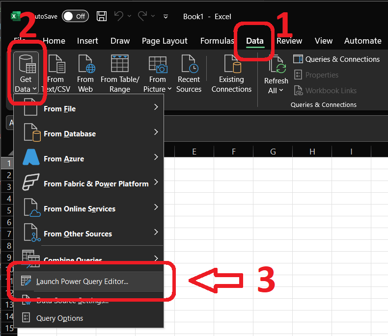
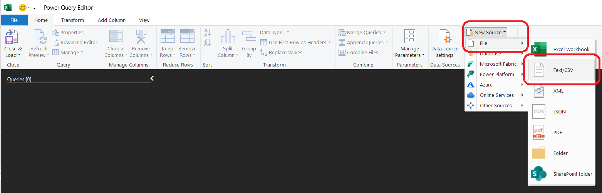
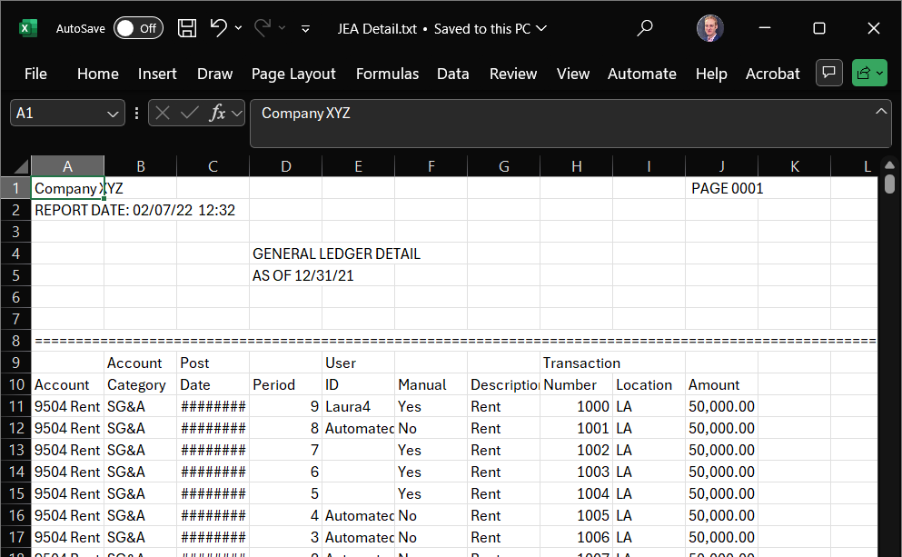

# Lab 2: Connecting to and Cleaning Data

Lab 2 builds on our first lab by moving from simply opening a clean, well-structured file to tackling a more realistic challenge: importing and cleaning a poorly formatted journal entry data. We will work with a dataset of journal entries that contains extra header lines and page breaks that must be removed before analysis can begin. This lab will reinforce the initial data connection steps from Lab 1 and introduce basic data cleaning techniques.

[TOC]

## 1. Assignment


**Submission:** a PDF document with two screenshots of:

  * A table showing the cleaned dataset (at least including all columns and the first few rows)
  * A table showing count of transactions for each user by period (Wide format dataset after pivoting)


### 1.1. Learning Objectives

By the end of this lab, you will be able to:

  * Import data from a text file.
  * Identify and remove unnecessary rows (like headers and page breaks) from a dataset.
  * Perform basic data transformations to prepare data for analysis.
  * Perform initial exploration of data content.


### 1.2. Rubric and Grading

1. **Submitted**: *Submitted the assignment*
    * **3 - Successful:** Submitted a completed solution. (80 pts)
    * **2 - Successful - late:** Submitted a completed solution after the deadline. (70 pts)
    * **1 - Incomplete:** Submitted a partial result. (50 pts)
    * **0 - No Evidence:** No submission. (0 pts)
2. **Mastery**: *Submitted the assignment in more than one modality. Expectation is just one, this is for more points and more experience.*
    * **2 - Exceeds:** Submitted in three or more modalities, amazing job! (10 pts)
    * **1 - Mastery:** Submitted in two modalities, fantastic job! (5 pts)
    * **0 - Expected:** Submitted one modality, great job! (0 pts)
3. **Subjective** quality: *Subjective estimate of the quality of the output. For this lab, that will be based on the appearance and clarity of the output and tables demonstrated in your screenshots.*
    * **3 - High Quality:** Beautiful, graceful, clever, or otherwise high quality product. (15 pts)
    * **2 - Good Quality:** Aesthetic, elegant, logical, or otherwise good quality. (10 pts)
    * **1 - Low Quality:** Messy, quick, illogical, confusing, or otherwise low quality product. (5 pts)
    * **0 - None:** No submission. (0 pts)

*AI useage note: I developed this rubric in Canvas, then I took a screenshot of it, pasted it into Gemini with the prompt "Please transcribe this rubric to markdown format", and got the above text. I tell you this as a reminder of little uses of LLMs that add up to save a whole lot of time.*


## 2. Pivot Tables Deep Dive

A crucial skill in data analytics is the ability to summarize and cross-tabulate data using pivot tables. Pivot tables allow you to reorganize and aggregate data to reveal patterns that might not be obvious in the raw data format.

### 2.1. Excel Pivot Tables

Excel provides powerful pivot table functionality through its "Data" tab:

1. **Creating a Pivot Table:** [Tutorial](https://support.microsoft.com/en-us/office/create-a-pivottable-to-analyze-worksheet-data-a9a84538-bfe9-40a9-a8e9-f99134456576)
    * Select your cleaned data table
    * Go to "Insert" > "Pivot Table"
    * Choose to place the pivot table in a new worksheet
    * Drag fields from the Field List to the appropriate areas:
        * **Rows**: Categories you want to group by (e.g., `User ID`)
        * **Columns**: Categories you want to spread across columns (e.g., `Period`)
        * **Values**: Numeric fields you want to aggregate (e.g., `Sum of Amount`)

2. **Excel Advantages:**
    * Intuitive drag-and-drop interface
    * Easy to filter and sort
    * Built-in formatting options
    * Can easily create charts from pivot table data

3. **Best Practices:**
    * Ensure your source data is properly formatted as a table
    * Use meaningful field names in your headers
    * Consider using slicers for interactive filtering


### 2.2. Tableau Pivot Tables (Cross-Tabs)

Tableau calls pivot tables "cross-tabs" and integrates them seamlessly with visualization:

1. **Creating a Cross-Tab:** [Tutorial](https://www.youtube.com/watch?v=A4UTrZw-2jY)
    * Drag dimensions to Rows and Columns shelves
    * Drag measures to the Marks card, typically to Text
    * Use the "Show Me" panel and select the cross-tab option
    * Right-click to add totals and grand totals

2. **Tableau Advantages:**
    * Immediate visual feedback
    * Easy to convert to other chart types
    * Built-in statistical functions
    * Can handle very large datasets efficiently
    * Interactive filtering and highlighting

3. **Best Practices:**
    * Use color coding to highlight important values
    * Add reference lines or bands for context
    * Consider using calculated fields for custom aggregations


### 2.3. Python Pivot Tables

Python pandas provides flexible pivot table functionality with the `pivot_table()` function:

1. **Creating a Pivot Table:** [Documentation](https://pandas.pydata.org/pandas-docs/stable/user_guide/reshaping.html)
    ```python
    # Basic pivot table
    df.pivot_table(
        index='Row Variable',
        columns='Column Variable',
        values='Value to be aggregated',  # Column to calculate
        aggfunc='aggregation function',   # e.g. sum, count, mean, median, std, etc.
        margins=True,                     # Add a total column
        margins_name="Total",             # Set the total column name
    )
    ```

2. **Python Advantages:**
    * Complete programmatic control
    * Easy to automate and reproduce
    * Can handle complex multi-index pivots
    * Integration with statistical analysis
    * Custom formatting and export options

3. **Best Practices:**
    * Use meaningful variable names
    * Handle missing values appropriately with `fill_value`
    * Format output for readability using styling options


### 2.4. Comparing Approaches

Each tool has its strengths for different use cases:

* **Excel**: Best for ad-hoc analysis and sharing with non-technical users
* **Tableau**: Best for interactive dashboards and visual exploration
* **Python**: Best for automated analysis and complex data transformations

The key insight is that all three approaches can produce similar analytical results, but the choice depends on your audience, the complexity of your analysis, and your need for automation or interactivity.


## 3. Data

The dataset for this lab is `JEA Detail.txt`, a **tab-separated value (TSV)** file containing journal entry line items. This is a type of **delimited text file**, which is a common ways to store and exchange tabular data. Instead of a special format like an Excel `.xlsx` file, these are simple text files that can be opened by almost any application.

??? "More information on delimited files"
    In delimited files, columns are separated by a specific character, the **delimiter**. Common delimiters include:

    * **Comma (`,`)**: These are called Comma-Separated Values, or CSV files. This is the most common type of delimited file.
    * **Tab (`\t`)**: These are Tab-Separated Values, or TSV files, like the one we are using.
    * **Pipe (`|`)**: These are Pipe-Separated Values.

    Another related format is a **fixed-width file**, where each column is a specific number of characters wide, and data is padded with spaces to fit.

    While delimited files are very portable, that portability can lead to issues. They are often generated by legacy systems or as simple data dumps, resulting in "dirty" data that requires cleaning. Common problems include:
    * **Non-tabular features**: The file might contain extra information at the beginning or end, such as a report title, a description, a timestamp, or, in our case, repeating page headers and footers that are not part of the data itself.
    * **Uneven rows**: Some rows might have fewer columns than others, often due to missing trailing delimiters for empty values at the end of a line.
    * **Quoting and encoding issues**: Text data that contains the delimiter (e.g., a comma in a description field) must be handled carefully, usually by quoting the text. The file's character encoding (e.g., UTF-8 vs. ASCII) can also cause problems if not interpreted correctly.
    * **Inconsistent data types**: A column might contain a mix of numbers and text, making it difficult for software to automatically detect the correct data type.


Our file, `JEA Detail.txt`, represents a common scenario where a system output is not perfectly structured for direct use in analytics tools. It includes repeating header sections and other non-data lines that we will need to remove before any further understanding or analysis can be conducted.

For reference, here is the first few lines of the file:

```txt
Company XYZ                                                                                                PAGE 0001
REPORT DATE: 02/07/22  12:32                                                                                        
                                              GENERAL LEDGER DETAIL                                                 
                                              AS OF 12/31/21                                                        
====================================================================================================================
                   Account   Post               User                            Transaction                         
Account            Category  Date       Period  ID         Manual  Description  Number       Location  Amount       
9504 Rent Expense  SG&A      9/11/2024  9       Laura4     Yes     Rent         1000         LA        " 50,000.00 "
9504 Rent Expense  SG&A      8/11/2024  8       Automated  No      Rent         1001         LA        " 50,000.00 "
```


## 4. How-to Steps

The following sections outline how to perform the lab in each modality.

### 4.1. Excel Steps

This lab can be done using base Excel, or by testing out Excel's Power Query (Get & Transform Data), which is a tool for these kinds of cleaning tasks, among other great uses.

1. **Open Dataset:**
   * **Option A:** Using Base Excel:
      * Open Excel.
      * Drag the `JEA Detail.txt` file into the Excel window. Excel will open it easily, doing all the hard bits that the Python folk have to figure out manually.
   * **Option B:** Using Power Query
      * Open Excel.
      * Go to the "Data" tab on the ribbon (you may have to open a blank worksheet if you don't see the ribbon).
      * In the "Get & Transform Data" group (far left), click "Launch Power Query Editor...".
      
      * In the "Home" tab, select "New Source" > "File" > "Text/CSV".
      
      * Select the `JEA Detail.txt` file and click "OK" in the subsequent window (which will be showing you the first 100 rows of the file).
      * *Optional: Clean the data*
          * *Use the "Remove Rows" feature to remove the top rows until you get to the actual headers.*
          * *Use the "Use First Row as Headers" button to promote the correct header row.*
          * *Filter out any remaining junk rows (e.g., rows that are completely null or contain page break markers). You can filter a column to exclude `null` values or specific text.*
      * Once the data is loaded (or cleaned, if you so choose), click "Close & Load" in the top-left corner of the Power Query Editor. The cleaned data will be loaded into a new sheet in your workbook.
2. **Clean the Data**
    1. You should see an improperly formatted set of data, like this:
    
    2. You will notice extra header rows, and other issues throughout the file.
    3. You now need to clean the data, which can be done manually, in Excel or with the Power Query tools (see above).
        * *Suggested steps:* Delete Non-tabular rows, fix headers, convert range to table (`Ctrl + T`/`Cmd + T`), filter bad rows, clean `User ID` (consider the `TRIM` and `CLEAN` functions in Excel as a solution. `TRIM` will not work, while `CLEAN` will. Why?)
3. **Converting Long to Wide:** Pivot Tables
    1. Click anywhere in your cleaned data table (Excel should automatically detect the full range).
    2. Go to the "Insert" tab on the ribbon and click "PivotTable".
    3. In the "Create PivotTable" dialog box, ensure the table/range is correct and that the new PivotTable will be placed in a new worksheet. Click "OK".
    4. The "PivotTable Fields" pane will appear on the right.
    5. Drag `User ID` from the field list to the "Rows" area. This will create a row for each unique user
    6. Drag `Period` to the "Columns" area. This will create columns for each accounting period (1-12)
    7. Drag `Amount` to the "Values" area. It will likely default to `Sum of Amount`. To change this:
        * Click on `Sum of Amount` in the "Values" area.
        * Select `Value Field Settings...`.
        * In the dialog box, choose `Count` from the list.
        * Click "OK".
    8. Your pivot table should now show the count of transactions by each `User ID` across different `Period`s
    9. *Optional:* Format the result:
        * Right-click anywhere in the pivot table and select "PivotTable Options" to add grand totals if needed
        * Consider the "Design" tab in the ribbon that appears when the pivot table is selected.

### 4.2. Tableau Desktop Steps

Tableau Desktop's Data Source tab offers tools to clean data upon import. 

*Note:* If you are using Tableau Cloud, for some reason the "Data Interpreter" feature does not work as expected on text files. The workaround is to open the text file in Excel, and then save it as an excel file. Don't do any cleaning, don't touch anything, just save as an excel file. That's all. Then the magic Tableau AI data cleaning will work. You could also do all the cleaning in Excel as outlined above, then import that cleaned file into Tableau for pivoting / analysis / visualization. This kind of hybrid workflow is very common in industry, and it lets each modality's strengths shine!

1. **Connect to Data:**
    * Open Tableau.
    * On the "Connect" pane, click on `Text File`.
    * Navigate to and select `JEA Detail.txt`. **Note:** If using Tableau Cloud, first open the text file in Excel and save it as an Excel file, then connect to that Excel file instead.
2. **Clean the Data with Data Interpreter:** 
    * Tableau will open the Data Source tab. It will misinterpret the file structure initially.
    * In the left pane, under "Sheets", turn on the `Data Interpreter` checkbox.
    * Data Interpreter will analyze the file and identify the actual data table, often correctly removing headers and footers.
        * I had to rename a few columns, e.g. `F3` &rarr; `Post Date`. See table snippet above for column names.
    * Review the results to ensure the data looks correct.
    * You may need to add filters to remove any remaining unwanted rows.
3. **Go to Worksheet and Explore:**
    * Click on "Sheet 1" to open the analysis / visualization step.
4. **Converting Long to Wide:** Pivot Tables in Tableau Cloud are almost default functionality, which is great!
    1. Drag the `User ID` dimension from the Data pane (on the left) to the `Rows` shelf.
    2. Drag the `Period` dimension to the `Columns` shelf (*Tip*: For a good looking pivot table, consider making `Period` a `Discrete` `Dimension`).
    3. Drag the `Amount` measure to the `Text` mark on the Marks card. Tableau will automatically create a cross-tab view.
    4. By default, Tableau will likely aggregate `Amount` as a sum (`SUM(Amount)`). To change this to a count:
        * Right-click the `SUM(Amount)` pill on the Marks card.
        * In the context menu, go to `Measure(Sum)` and select `Count`.


### 4.3. Python Steps

Note to Python users: as with all programming, our lives are simultaneously easier and harder. Easier, because we are in control of every byte of data and can set up automation to be far more robust. Harder, because we must control of every byte of data and must set up automation to be far more robust. In this Lab, that means we need to be explicit about handling each data issue in the file that tools like Excel and Tableau might manage for us. To get you started, I have prepared a notebook that you can open on Colab. Merely click the link below to open Colab, then drag the `JEA Detail.txt` file into the Colab file explorer so the code can access it.

<a href="https://colab.research.google.com/github/gaulinmp/AccountingDataAnalytics/blob/main/labs_hw/week2_connecting-to-data/Lab 2 - Opening and Cleaning Data.ipynb" target="_parent">

</a>

We will use the `pandas` library in a Jupyter Notebook to programmatically clean the data.

1. **Setup Notebook:**
    * Open my starter notebook in Google Colab (or a local Jupyter Notebook if you're adventurous).
    * If in Colab, upload the `JEA Detail.txt` file to your session storage.
2. **Load and clean the data:**
    * We will import the data, but since it's poorly formatted, we'll need to handle the import carefully. The starter notebook I've provided walks you through that, as well as debugging you might do in a real scenario.
3. **Converting Long to Wide:** Pivot Tables in pandas are straightforward, using the code shown above, you just have to set the right variable names (and aggregation function)
    ```python
    df.pivot_table(
        index='Row Variable',
        columns='Column Variable',
        values='Value to be aggregated',  # Column to calculate
        aggfunc='how to aggregate',       # 'sum', 'count', 'mean', 'median', 'std', etc.
        margins=True,                     # Add a total column
        margins_name="Total",             # Set the total column name
    )
    ```


## 5. Submission

To complete this lab, provide screenshots that you have successfully cleaned the data and performed the initial pivot in one or more modalities.

For each modality you wish to submit (please combine all screenshots into a single document), attach in a PDF:

* Capture a screenshot of the cleaned data table.
* Capture a screenshot of the Wide format dataset (after pivoting), showing the number of journal entries for each `User ID` by `Period`.
