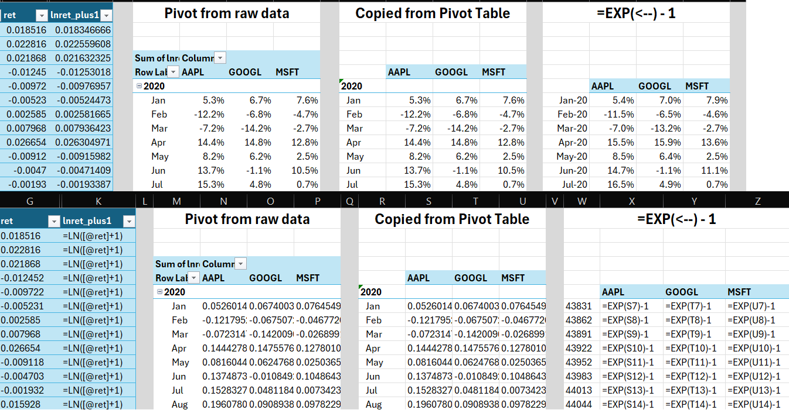

# Lab 5: Merging & Relational Databases

Lab 5 introduces you to using SQL to query and filter data. You will work with stock data from CRSP (featuring in Project 2).
The dataset is daily stock returns and volume data for a handful of companies since 1999.
You will upload the dataset to the web tool, write SQL queries to filter the data, download the results, and then use Excel or Python to aggregate and analyze return patterns and trading volumes.

This lab builds familiarity with SQL syntax and the process of "getting data" from a structured query engine.

[TOC]

## 1. Assignment

**Submission:** To complete this lab, complete the Canvas quiz, including uploading screen-shots & visualizations:

1. Screenshot of the resultant table after running the SQL query (or screenshot of your alternative SQL tool)
2. Line chart of daily returns for the 3 tickers over at least 5 years (starting January 2020)
3. Line chart of daily trading volume for the same tickers
4. Line chart of monthly returns for the same 3 tickers over the same time period
5. Line chart of the monthly trading volume for the same tickers

*Note*: Continue to consider the aesthetics of your visualizations, with clearly labeled axes and legends. For this Lab, however, it turns out that daily and monthly data are still pretty "noisy" looking, so don't expect the graphs to spark joy. {: .note}


### 1.1. Learning Objectives

By the end of this lab, you will be able to:

* Use SQL to select and filter time-series stock data
* Aggregate daily return data to monthly frequency using buy-and-hold logic
* Create visualizations to analyze time-series data at different frequencies, and understand the smoothing effect of aggregation


## 2. Data

The dataset for this lab is provided as a CSV file on Canvas (`lab5_data_crsp.csv`), containing daily stock return data for a handful of companies. You will upload this CSV to the web-based SQL tool to query it.

### 2.1. Accessing the Data

* **Tool URL**: [mgaulin.com/ada/sql](https://mgaulin.com/ada/sql)
* **Input File**: `lab5_data_crsp.csv` (Download from Canvas)

### 2.2. Data Dictionary

* `permno`: Security identifier (unique to each security)
* `ticker`: Stock ticker symbol (e.g., `AAPL`, `MSFT`, `GOOGL`)
* `shrcls`: Share class (e.g., `Common Stock`)
* `date`: Trading date (skips weekends and holidays)
* `ret`: Daily stock return (decimal, e.g., 0.05 = 5%)
* `prc`: Stock price per share
* `shrout`: Shares outstanding (in thousands)
* `vol`: Trading volume (number of shares traded)
* `bid`: End of day bid-price
* `ask`: End of day ask-price


## 3. How-to Steps

The general outline for Lab 5 will be:

1. Get filtered data using SQL
    1. Open the [SQL Query Tool](https://mgaulin.com/ada/sql) and upload the `lab5_data_crsp.csv` file
    2. Paste/write your SQL query to filter the data for tickers `AAPL`, `MSFT`, and `GOOGL` starting from 2020
    3. Take a screenshot of the Query Results (showing 10 / 3774 rows)
    4. Download the filtered data as a CSV
2. Import into Excel or Python
3. Aggregate daily returns to monthly frequency (optionally do so in SQL)
4. Create visualizations of daily returns, monthly returns, and trading volume
    1. Line chart of daily returns for the 3 tickers over at least 5 years (starting January 2020)
    2. Line chart of daily trading volume for the same tickers
    3. Line chart of monthly returns for the same 3 tickers over the same time period
    4. Line chart of the monthly trading volume for the same tickers


My notes on the workflows:

* **Excel:** Pivot required to turn daily data into something plotable, and more difficult pivot required to aggregate to monthly
* **Python:** Plot for daily values is a one-liner, aggregating to monthly is a one-line pivot, then plot.
* **SQL (for Monthly aggregation):** You can do the aggregation directly in the SQL query (see optional section below), which makes the Excel step simpler.


### 3.1. Step 1: Query Data (Web Tool)

1. Navigate to [mgaulin.com/ada/sql](https://mgaulin.com/ada/sql)
2. Drop the `lab5_data_crsp.csv` file you downloaded from Canvas on the top right of the page (note: top left is for uploading Compustat financials, and then merging them with CRSP, which is foreshadowing for next week...)
3. The CRSP table should now show up where you dropped the file, showing you the first few rows of the data (not all!) so you can see the columns and data types
4. In the SQL editor, paste/write the query to select your desired data:
    ```sql
    SELECT *
    FROM crsp
    WHERE ticker IN ('AAPL', 'MSFT', 'GOOGL')
      AND date >= '2020-01-01'
    ```
5. Click `▶ Run Query` to see the results in the pane on the right
6. Take a screenshot of the results and upload it to Canvas
7. Download the filtered data as a CSV by clicking the `⬇ CSV` button


### 3.2. Step 2 (Option A): Excel Visualization

1. Open the downloaded CSV file in Excel (I suggest using power query to import the data, good practice and easy setting of data types like dates)
2. **Make Daily Charts**:
    1. Create a PivotTable
    2. Set `date` as the Axis (Categories), `ticker` as the Legend (Series), and `ret` (or `vol`) as the Values
    3. Create a Pivot Chart: from the "PivotTable Analyze" tab, select "PivotChart"
    4. Ensure the chart type is a Line Chart (NOT stacked line)
3. **Make Monthly Charts**:
    1. Save the file as a .xlsx file (this is only needed for the Data Model method in the monthly charts)
    2. Verify if the CSV dates are recognized as dates (and convert them if not)
    3. Create a new column for Month-Year (e.g., cell custom format `yyyy-mm`)
    4. Calculate Monthly Returns: Use a PivotTable or helper columns
        * *PivotTable Method*: Use the Data Model + Measure `=PRODUCTX(Table1, [ret] + 1) - 1`, assuming your table is called `Table1` (see Homework 3 for more details)
        * *Helper Column Method*: 
            1. Create a helper column, `ln  ret_plus1`, (`=LN(1+ret)`)
            2. Create a pivot table, with `ticker` as the Legend (Series), and `ln  ret_plus1` as the Values (which should default to `SUM`, if not set it to `SUM`)
            3. Drag date to the Axis (Categories). It should automatically add `Years (date)`, `Quarter (date)`, and `Month (date)` to the Axis (Categories). Uncheck (remove) `Quarter (date)` and the plain `date`, leaving just Year and Month
            4. Here's where it gets manual, because we now have the `SUM(LN(1+ret))` in our pivot chart, but we need to take the EXP of that to get the buy-and-hold return
            5. Copy the values from the pivot chart and paste them into a new table or sheet
            6. Create three new columns (one for each ticker), where the cells are `=EXP([value from the new table you copied from the pivot]) - 1`
            7. Create a line chart from this new-new table
            
    5. Plot the monthly values in a Pivot Chart, as you did for daily values

### 3.3. Step 2 (Option B): Python Visualization

The Python route should be mostly familiar by now, but there's that monthly aggregation step that might be new.

1. Load and Clean Data
    ```python
    import pandas as pd
    import seaborn as sns
    import matplotlib.pyplot as plt

    # Load the file downloaded from the SQL tool
    # Make sure the filename matches what you downloaded
    df = pd.read_csv('full_results.csv', parse_dates=['date'])

    # Preview
    df.head()
    ```
2. Plot daily values
    1. Replace the placeholders with the right variable names for returns and volume, which you can see in the `df.head()` output above)
    ```python
    sns.lineplot(data=df, x='date', y='Y VARIABLE', hue='ticker')
    ```
3. Aggregate to Monthly Frequency
    1. To get monthly data, we need to group by Ticker and Month. We calculate a *Geometric Return* for the returns (compound return) and *Sum* for volume.
    ```python
    # Create a Monthly Period column for grouping
    df['year_month'] = df['date'].dt.to_period('M')

    df_monthly = (
        df
        .groupby(['ticker', 'year_month'])
        .agg(
            # Geometric Return: Product of (1+r) - 1
            return_monthly=('ret', lambda x: (1 + x).prod() - 1),

            # Volume: Simple Sum
            volume_monthly=('vol', 'sum'),
            
            # Keep the last date of the month for plotting
            date=('date', 'last')
        )
        .reset_index()
    )

    df_monthly.head()
    ```
4. Plot monthly values
    ```python
    sns.lineplot(data=df_monthly, x='date', y='Y VARIABLE', hue='ticker')
    ```


### 3.4. Optional: Aggregation in SQL

An alternative to doing the aggregations (grouping by month, calculating geometric returns) in Excel or Python is to do it directly in SQL. This is often faster and cleaner.

You can modify your query to group by month and ticker, and calculate the cumulative return for that month.

**Grouping Key**: We need to extract the Year-Month from the date. SQLite Function: `strftime('%Y-%m', date)`, which stands for *string format time*.

**Geometric Return**: We need $(1+r_1) * (1+r_2) ... - 1$.

* Since SQL doesn't usually have a product aggregate function, we use logarithms: $exp(\sum(ln(1+r))) - 1$ ([Stack Overflow Explanation](https://stackoverflow.com/a/25701090))
* SQLite Function: `EXP(SUM(LOG(1+ret))) - 1`

So putting it all together:

```sql
SELECT 
    strftime('%Y-%m-01', date) AS year_month, 
    ticker, 
    EXP(SUM(LOG(1+ret)))-1 AS monthly_ret,
    SUM(vol) as monthly_vol
FROM crsp
WHERE ticker IN ('AAPL', 'MSFT', 'GOOGL')
  AND date >= '2020-01-01'
GROUP BY 
    year_month, 
    ticker
ORDER BY 
    year_month, 
    ticker
```

Downloading this result gives you a second dataset that is *already* monthly, so you just need to plot it!

*Note*: Yes, you could just put the CSV file in Excel/Python and do the filtering & aggregation there, but then you'd miss out on seeing SQL in action, which would be an absolute travesty! {: .note}
